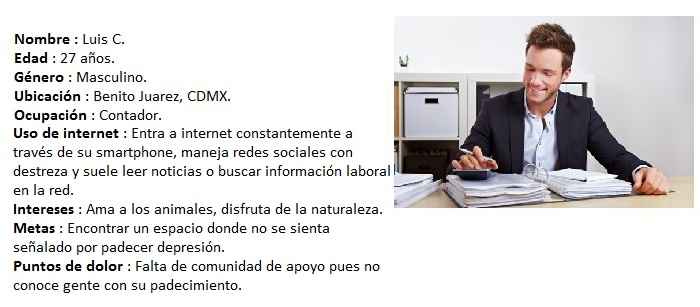
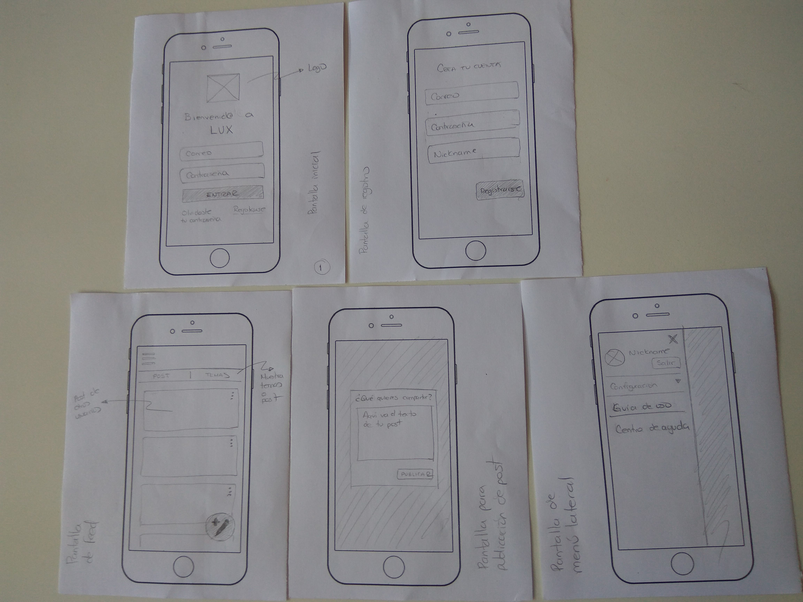
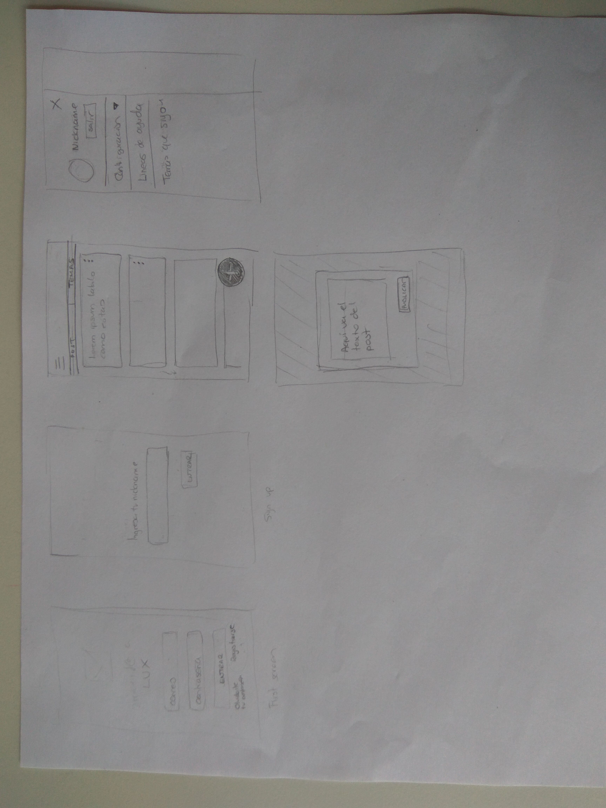

# Lux
## Ilumina tu día a día con nosotros

De acuerdo con Nicholas A Christakis (2010) el uso de internet nos ha facilitado nuevas formas sociales que introducen cuatro modificaciones radicales en los tipos de redes de interacción social existentes hasta ahora:
* Enormidad: la vasta magnitud de nuestras redes y del número de personas a las que se puede llegar.
* Comunalidad: una ampliación de la escala en la que podemos compartir información y contribuir a esfuerzos colectivos.
* Especificidad: un impresionante incremento en la particularidad de los vínculos que podemos formar.
* Virtualidad: La capacidad de asumir identidades virtuales.

Las redes sociales _virtuales_ nos ofrecen nuevas oportidades para facilitar el mantenimiento de vínculos y conexiones entre las personas.
> Los portales de redes sociales se utilizan para seguir los pasos de amigos y parientes reales, por supuesto, pero la mayoría de la gente mantiene conexiones virtuales con personas, [...] con las que no podrían no sentirse cómodas charlando en un bar.

En esencia los servicios de redes sociales fundamentalmente reflejan interacciones reales, no virtuales, es decir, todo tipo de aplicaciones y plataformas que integran al usuario en el proceso de producción y consumo de contenidos que permiten establecer un diálogo social y mediático. 
  Teniendo en cuenta la estructura y la funcionalidad de las redes sociales (virtuales y no virtuales) y la importancia en el mundo digital así como fuera de este, podemos encontrar un  beneficio en el uso adecuado y enfocándose en las necesidades o carencias de cierto sector social.
 A partir de una experiencia propia así como un análisis (que se mencionará a continuación) se decidió implementar una red social de apoyo emocional en donde se hará uso de un mecanismo de refuerzo positivo para las personas que  puedan llegar a necesitarla.

### El papel de las redes sociales de apoyo en la prevención de la depresión y ansiedad.
La depresión es una enfermedad frecuente en todo el mundo, y se calcula que afecta a más de 300  millones de personas. Cada año se suicidan cerca de 800,000 personas, y el suicidio es la segunda causa de muerte en el grupo etario de 15 a 29 años.
>Aunque hay tratamientos eficaces para la depresión, más de la mitad de los afectados en todo el mundo, y más del 90% en muchos países, no recibe la atención adecuada. Entre los obstáculos principales que impiden una atención eficaz se encuentran la falta de recursos y de personal sanitario capacitados, además de la estigmatización de los trastornos mentales y la evaluación clínica inexacta. Otra barrera para la atención eficaz es la evaluación errónea. En países de todo tipo de ingresos, las personas con depresión a menudo no son correctamente diagnosticadas, mientras que otras que en realidad no la padecen son a menudo diagnosticadas erróneamente y tratadas con antidepresivos.

En Latinoamérica, Brasil es el país con mayor prevalencia de depresión con 5,8 por ciento; seguido de Cuba con 5,5 y Paraguay con 5,2. Chile y Uruguay tienen el 5 por ciento; Perú, 4,8; mientras Argentina, Colombia, Costa Rica y República Dominicana muestran 4,7 por ciento.
A ellos les siguen Ecuador con 4,6 por ciento; Bolivia, El Salvador y Panamá con 4,4 por ciento; México, Nicaragua y Venezuela con 4,2 por ciento; Honduras con 4,2 por ciento) y Guatemala con el 3,7 por ciento.

Acorde con la OMS, la depresión es el resultado de interacciones complejas entre factores sociales, psicológicos y biológicos. Aquellas personas que han pasado por circunstancias adversas como el desempleo, luto o traumatismos psicológicos tienden a tener más probabilidades de sufrir depresión y esta a su vez, puede generar más estrés y disfunción, empeorar la situación vital de la persona afectada y, por consiguiente, la propia depresión.En México, según Corina Benjet, investigadora del Instituto Nacional de Psiquiatría Ramón de la Fuente Muñiz (INPRFM) la población más vulnerable son jóvenes entre el rango de 15 y 24 años de edad.En este contexto la existencia de redes de apoyo para una persona es vital ya que previene la exclusión social además de mejorar la salud tanto física como mental fortaleciendo el bienestar general de la persona. Sin embargo, tener o contar con estas puede ser difícil, especialmente si se está pasando por un periodo de crisis.   
>**Una de nuestras metas creando Lux, es generar un espacio seguro para las personas que están pasando por problemas similares en donde puedan encontrar una red de apoyo en la cual expresarse y sostenerse a través de la auto ayuda y la ayuda mutua.** 

## Observar y conocer para empezar a actuar
Como primera aproximación a la opinión pública, se decidió usar la modalidad de método de encuesta no estructurada en forma de cuestionario para la recopilación de datos en la creación y el uso de una red social enfocada a generar redes de apoyo para gente que padece o sufre depresión y/o ansiedad.Dicha encuesta fue publicada en grupos cuyo propósito es la ayuda a gente con depresión y/o ansiedad, sin embargo, el nivel de actividad dentro de estas comunidades en Facebook y foros en internet no es tan grande o caen casi en el abandono.También se publicó en redes como Slack y se pidió a familiares así como amigos cercanos y contactos que contestaran la encuesta.Las preguntas realizadas en la encuesta fueron las siguientes:

	* ¿Cuál es tu edad?
	* ¿Con qué género te identificas?
	* ¿A qué te dedicas?
	* ¿Consideras que tienes depresión?
	* ¿Consideras que tienes ansiedad?
	* ¿Conoces a alguien con estos padecimentos?
	* Si tu respuesta es afirmativa, la persona que conoces es:
	* ¿Cuentas con una red de apoyo emocional?
	* ¿En caso de que la tengas, cómo interactúas con ella?
	* Si no tienes una red de apoyo, ¿te gustaría contar con una?
	* ¿Por qué?
	* ¿Usarías una red social enfocada en generar redes de apoyo para personas con depresión y ansiedad?
	* ¿Por qué?

# Análisis preliminar de las encuestas
Si deseas ver las gráficas, sigue el enlace:
https://ibb.co/album/gozdyv  
Se logró obtener un total de 39 participantes de las cuales 27 se identifican con el género femenino y el restante con el masculino.
Las actividades de nuestros encuestados se resumen en las siguientes:
19 estudiantes y 20 trabajadores ya sea empleados o freelancers y el rango de edad es de 17 a 46 años.
Al preguntar si padecían de depresión solamente el 16% contestó afirmativamente mientras que el 59% consideraban que no la padecían. Sin embargo, cuando se preguntó si consideraban que padecían ansiedad las cifras se invirtieron.
El 38% respondió que no consideraban tener ansiedad mientras que el 61% consideraban tenerla.
Cuando se preguntó si conocían a alguien que padeciera tanto de depresión como de ansiedad, el 71% respondió afirmativamente.
El 50% respondió que se trataba de algún amigo, mientras que el porcentaje restante se concentraba en algún conocido o familiar. Sorprendentemente el 76% de los encuestados respondieron negativamente al preguntarles si contaban con una red de apoyo emocional, y el 23% restante se mantenían en contacto con esta principalmente en persona, pero hacían uso de otras herramientas como el uso de internet o teléfono.
Del 76% , es decir 30 personas, que respondieron negativamente al tener una red de apoyo emocional, 26 es decir el 66% dijeron que les gustaría contar con una, mientras que el 17% no estaba seguro y el restante no tenía interés alguno. Así mismo, al preguntarles si usarían una red social enfocada en generar apoyo para personas con depresión y/o ansiedad la respuesta fue positiva.
En resumen, el generar redes de apoyo tanto para este sector vulnerable así como el sector restante de la población es de suma importancia.

>“Porque a veces es difícil hablar de esos temas con conocidos, tal vez hacerlo con otrxs que han pasado por lo mismo sea más fácil”

La creación de espacios seguros, en este caso en forma de una plataforma online para las personas que no pueden o se les dificulta hablar sobre los problemas que tienen, resulta indispensable por diversas razones, principalmente los mismos padecimientos y el aislamiento que deviene de estos, así como la facilidad y practicidad que tiene una aplicación.
También es importante resaltar que los encuestados se encontraron interesados en participar en la plataforma para informarse y conocer más sobre estos transtornos y poder ayudar en un futuro a las personas que lo llegaran a necesitarar:

>“Entiendo como es tener ansiedad y me gustaría aprender mejor cómo apoyar a otros”.

>“Me gustaría conocer personas que están pasando por algo similar, que me escuchen y poder ayudarlas también”.
“Porque una persona muy cercana padece depresión y me gustaría apoyarla con más herramientas”

>“Me gustaría poder hacer amigos, que compartan tips y que promocionen eventos o recomiendes sitios donde relajarse; así como crear grupos”.

# Proto-personas
Despues de recopilar, analizar la información y obtener la primera aproximacion a las necesidades y los objetivos determinamos dos prototipos de personas:

# Historias de usuario 
## Login
A) Yo como usuarix con depresión y/o ansiedad quiero poder registrarme en una red social que me permita conectarme con personas que están atravesando o han superado una experiencia similar.

- Yo como usuarix de esta red social busco poder loguearme con mi correo y una contraseña para empezar a usarla.
- Yo como usuarix registradx en esta red social quiero poder usar un nickname para ocultar mi identidad al usar la red.

B) Yo como usuarix logueadx de esta red social quiero poder postear un mensaje sobre algo que me hizo/hace feliz.

C) Yo como usuarix quiero poder ver los post de otras personas.

D) Yo como usuarix quiero poder interactuar con otrxs usuarixs sobre temas en común.

- Yo quiero poder proponer un tema de conversación.
- Yo quiero que otrxs usuarixs puedan unirse al tema de conversación.
- Yo quiero poder unirme a temas de conversación existentes.

## Muro
A) Yo como usuarix de LUX quiero poder publicar un nuevo post para que otros usuarixs de LUX lo vean.

B) Yo como usuarix de LUX quiero poder indicar los post que más me gusten para que el autor sepa que me gusta su idea, la comparto o me siento relacionadx con lo que publico.

C) Yo como usuarix de LUX quiero que otros usuarios puedan indicar si mi post les gusto para saber si comparten mi idea o se sienten relacionadxs con lo que publique.

D) Yo como usuarix de LUX quiero poder editar mis post para cambiar el texto si me equivoque o quiero que diga algo diferente.

E) Yo como usuarix de LUX quiero poder borrar mis post para que desaparezcan de la plataforma y ya no puedan ser vistos por otrxs usuarixs.

F) Yo como usuarix de LUX quiero poder ver primero los post más recientes para mantenerme al tanto de las últimas publicaciones.

G) Yo como usuarix de LUX quiero poder cerrar mi sesión para que mi actividad dentro de la plataforma se mantenga privada.

## #BuildALadder
> This method of actively uplifting yourself, doing what little things you can every day but allowing yourself to be sad other days when you need it most, might be one of the most important things you can tell anyone who suffers from depression, chronically or otherwise.

Tomamos como referencia el concepto (así como el hashtag) de #BuildALadder, en donde principalmente se celebran los logros personales de las personas que sufren de depresión sin importar el tamaño de estos. Con el uso de este hashtag se comparten experiencias así como ideas positivas para mejorar paso a paso y también distintas formas de de lidiar y afrontar los problemas.

## Benchmark 1.0

En conjunto con la elaboración de encuentas y su análisis preliminar, se empezó a trabajar en un Benchmark para permitirnos analizar tanto los sitios web como las aplicaciones móviles con la que se compartía una visión similar.

Enlace del benchmark 1.0: https://ibb.co/album/c89HrF

## Benchmark 2.0
 Acorde al feedback recibido de UX Coach Karla Nava decidimos implementar cambios en cunato a la estructura del benchmark 1.0, estos constaron en: 
 - Reestructuracion de tabla.
 - Jerarquia en contenido
 - Comparativos en Login
 - Comparativos en Muro

Enlace del benchmark 2.0: https://ibb.co/album/bGmmka

## Regístro y login
Principalmente, la forma de registro consta en obtener el correo y contraseña del futuro usuario, sin embargo, también se tiene planeado implementar la función de regístrarse y loguearse a la cuenta tanto con facebook y google.  
En un principio se tenía contemplado solamente el acceso y el regístro mediante un nombre usuario, correo electrónico y un password, sin embargo, por comodidad del usuario se agregó la opción de loguearse mediante Google.

## Conclusión
La seguridad y seriedad en este tipo de aplicaciones es cuestionable y estas se pueden volver detonantes en personas con trastornos psicológicos debido a que no se puede garantizar que toda la gente que ingresa realmente padezca depresión o simplemente use las apps para divertirse e incluso practicar bullying a los diversos usuarios de las mismas.

Detectamos en varias de las aplicaciones un mal uso de las mismas por parte de algunos usuarios que sólo se dedican a ofender y molestar a otros.

El idioma es otra barrera que no permite una comunicación asertiva entre usuarios y expertos, hace falta que existan más apps con versión en español.

Hoy en día, menos es más y las propuestas actuales de las apps ofrecen textos largos y tediosos que dificultan la lectura y la hacen aburrida y cansada.

**Estas páginas son poco activas, volviéndose complicada la comunicación con algún experto de manera inmediata.

**Las páginas están saturadas de información excesiva y poco organizada.

# Buscando el nombre ideal

Trabajando en conjunto, se decidió aplicar una dinámica para la elección de un nombre que describiera nuestra visión y misión.
Dicha dinámica constó en una lluvia de ideas, en donde se pretendía obtener un nombre que fomentara una actitud positiva y de perseverancia ante la vida.   Se obtuvieron tres nombres tentativos:
* Lumos
* Luciérnaga
* Lux

El nombre que se eligió fue **Lux** [Luz en latín], ya que era sencillo y corto de memorizar, así mismo, refleja en una sola palabra lo que se pretende transmitir.

# Sketching

Después de elegir el nombre que nos representaría, decidimos dar el siguiente paso: Trabajar en la interfaz y el flujo de esta:

  

  

# Color

Se eligió una paleta monocromática basada en el color turquesa ya que en la psicología del color se cree que este tonalidad ayuda a abrir líneas de comunicación, transmite confianza y estabilidad.

También hay estudios que indican que los colores dentro de la gama de los azules nos permiten desahogarnos, transmite una sensación de calma y ayuda a pensar en la situación más ideal.

Algunas palabras asociadas con este color son: Balance, claridad, creatividad, autosuficiencia.

Todo esto se alinea con el mensaje que queremos transmitir a lxs usuarixs al usar la página web.

## Mobile First
El proceso del diseño de nuestra red social fue pensada desde el inicio para visualizarse principalmente en los dispositivos más pequeños, sin embargo, la adaptabilidad en dispositivos grandes, como un ordenador es completamente posible y amigable para el usuario.
 La decisión fue tomada debido a que el acceso a las redes sociales es principalmente a través de dispositvos móbiles gracias al fácil acceso que estos nos brindan.

#### Referencias

Nicholas A. Christakis y James H. Fowler, _"Conectados"_, 2010, Santillana Ediciones Generales.
Rivera de Javier, "Socialización Tecnológica", http://sociologiayredessociales.com/textos/SocializacionTecnologica-JavierdeRivera.pdf , Recuperado el 28 de Julio de 2018.
Rivera de Javier, "Un análisis sociológico del Me gusta" , https://ssociologos.com/2015/11/09/un-analisis-sociologico-del-me-gusta/ Recuperado el 30 de Julio de 2018
# Lux

Nuestra aplicación tiene como objetivo princial la creación de espacios seguros así como redes de apoyo emocional para personas que padeceden y/o sufren de depresión y/o ansiedad.

### ¿Cómo se usa?

Usuario: 
1. Da click en la siguiente liga -> https://alppacat.github.io/cdmx-2018-06-bc-core-am-social-network/src
2. Si es la primera vez que nos visitas, crea una cuenta y loguéate!
3. Si ya tienes una cuenta, loguéate y déjate llevar!

Contribuidor:

1. Forkea este repositorio.
2. Instala dependencias.
3. Solicita pull requests.

Nota: No olvides que aún seguimos trabajando en este proyecto, y por lo tanto nos encontramos en una versión Beta.